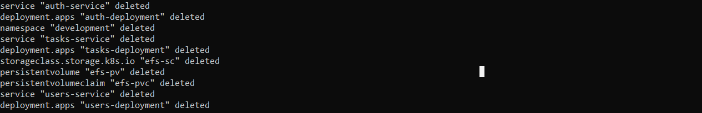
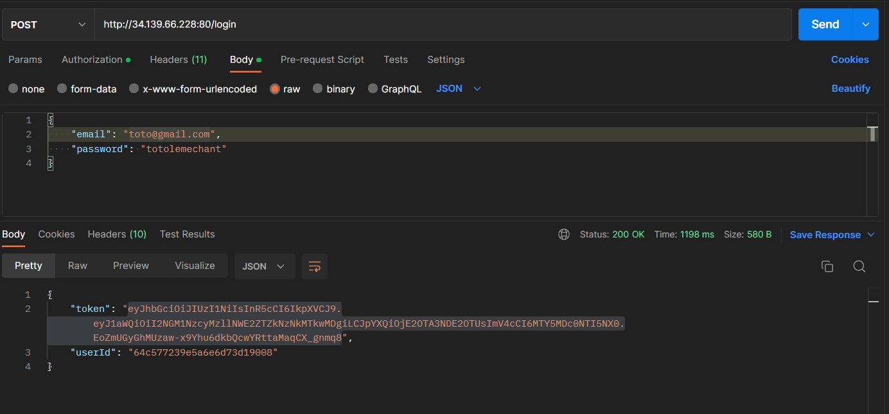

<div align="center">

  
  <h1>:pushpin::star2: Deploy Todo Task App with Kubernete</h1>
  
  <p>
    Deploy Authenticated Todo Task Application with Google Kubernetes Service
  </p>
  
  
<!-- Badges -->
<p>
  <a href="https://github.com/monthebrice2000/professional-portfolio-me/graphs/contributors">
    
  </a>
  <a href="">
    
  </a>
  <a href="https://github.com/monthebrice2000/professional-portfolio-me/network/members">
    
  </a>
  <a href="https://github.com/monthebrice2000/professional-portfolio-me/stargazers">
    
  </a>
  <a href="https://github.com/monthebrice2000/professional-portfolio-me/issues/">
    
  </a>
  <a href="https://github.com/monthebrice2000/professional-portfolio-me/blob/master/LICENSE">
    
  </a>
  <a href="https://github.com/monthebrice2000/professional-portfolio-me/pulls">
    
  </a>
  <a href="#">
    
  </a>
</p>
   
<h4>
    <a href="https://github.com/monthebrice2000/professional-portfolio-me/">View Demo</a>
  <span> · </span>
    <a href="https://github.com/monthebrice2000/professional-portfolio-me/">Documentation</a>
  <span> · </span>
    <a href="https://github.com/monthebrice2000/professional-portfolio-me/issues/">Report Bug</a>
  <span> · </span>
    <a href="https://github.com/monthebrice2000/professional-portfolio-me/issues/">Request Feature</a>
  </h4>
</div>

<br />
<!-- TABLE OF CONTENTS -->
<details open="open">
<summary>Table of Contents</summary>
  
- [:star2: About The Project](#star2-about-the-project-)
  - [:camera: Screenshots](#camera-screenshots)
  - [:space_invader: Tech Stack](#space_invader-tech-stack)
  - [:dart: Features](#dart-features)
- [:toolbox: Getting Started](#toolbox-getting-started-)
  - [:bangbang: Prerequisites](#bangbang-prerequisites)
  - [:gear: Installation](#gear-installation)
  - [:triangular_flag_on_post: Deployment](#triangular_flag_on_post-deployment)
  - [:test_tube: Tests APIs](#test_tube-tests)
- [:eyes: Usage](#eyes-usage-)
- [:wave: Contributing](#wave-contributing-)
- [:pencil2: Creators](#pencil2-creators-)
- [:scroll: Code Of Conduct](#scroll-code-of-conduct-)
- [:closed_lock_with_key: Security](#closed_lock_with_key-security-)
- [:warning: License](#warning-license-)
- [:handshake: Contact](#handshake-contact-)
- [:gem: Acknowledgements](#gem-acknowledgments-)

</details>

<!-- About the Project -->
## :star2: About The Project [🔝](#pushpinstar2-spring-cloud-kubernetes-k8s)
### :camera: Screenshots
<div align="center"> 
  
</div>
I built, containerized a full-stack authentication application and deployed it in Google Kubernetes Engine.

### :space_invader: Tech Stack

<details>
  <summary>API REST</summary>
  <ul>
    <li></li>
  </ul>
</details>

<details>
  <summary>Migrations</summary>
  <ul>
    <li><a href="https://hibernate.org/"></a></li>
  </ul>
</details>

<details>
  <summary>Server</summary>
  <ul>
    <li><a href="https://httpd.apache.org/"></a></li>
    <li><a href="https://spring.io/projects/spring-cloud-gateway/">Spring Gateway</a></li>
  </ul>
</details>

<details>
<summary>Database</summary>
  <ul>
    <li></li>
  </ul>
</details>

<details>
<summary>DevOps</summary>
  <ul>
    <li><a href="https://www.docker.com/"></a></li>
    <li><a href="https://kubernetes.io/"></a></li>
    <li><a href="https://minikube.sigs.k8s.io/docs/">Minikube</a></li>
  </ul>
</details>

### :dart: Features
  * [x] CRUD Category Service
  * [x] CRUD Product Service
  * [x] API Gateway Service

## :toolbox: Getting Started [🔝](#pushpinstar2-spring-cloud-kubernetes-k8s)

### :bangbang: Prerequisites
This project uses Google Kubernetes Engine (GKE), AWS Elastic File System (EFS), kubectl, gcloud to create cluster and deploy app cluster
This project also uses Postman API to test users APIs and tasks APIs

To use docker, gcloud cli, kubectl cli, aws cli, and postman:
- <a href="https://docs.docker.com/engine/install/ubuntu/">Install docker and containerd</a>
- <a href="https://kubernetes.io/docs/tasks/tools/">Install Kubectl</a>
- <a href="https://cloud.google.com/sdk/docs/install?hl=fr">Install gcloud</a>
- <a href="https://www.postman.com/downloads/">Install Postman API</a>

### :gear: Installation
Follow this link [kubectl](https://kubernetes.io/docs/tasks/tools/), [gcloud](https://cloud.google.com/sdk/docs/install?hl=fr) and [docker](https://docs.docker.com/engine/install/ubuntu/) to install kubectl, gcloud and docker

To check if kubectl and gcloud is installing, run 
```bash
  kubectl version
  gcloud version
  docker version
```
I use kubectl v1.25.0, gcloud (Google Cloud SDK 406.0.0, beta 2022.10.17, bq 2.0.79, core 2022.10.17, gcloud-crc32c 1.0.0, gke-gcloud-auth-plugin 0.4.0, gsutil 5.14) , and docker CLI v20.10.17 and docker Server engine v20.10.17

To handle credentials , install gke-gcloud-auth-plugin plugin:
- <a href="https://cloud.google.com/blog/products/containers-kubernetes/kubectl-auth-changes-in-gke?hl=en">Install gke-gcloud-auth-plugin plugin</a>
```bash
  gcloud components install gke-gcloud-auth-plugin
```

Activate GKE API:
- <a href="https://console.cloud.google.com/apis/library/container.googleapis.com">Activate Kubernetes Engine API </a>
<details>
<summary>Click to expand</summary>
    
</details>

Login to GCP with gcloud:
```bash
  gcloud auth login
```
<details>
  <summary>Click to expand</summary>
    
</details>

Connect to the project with id:
- <a href="https://cloud.google.com/resource-manager/docs/creating-managing-projects?hl=fr#updating_projects">Connect gcloud cli to the project id </a>
```bash
  gcloud config set project <PROJECT_ID>
```
<details>
<summary>Click to expand</summary>
    
</details>

Create **auth-cluster** kubernetes cluster in GKE with gcloud or console:
- <a href="https://cloud.google.com/kubernetes-engine/docs/how-to/creating-a-zonal-cluster?hl=fr#console">Create **auth-cluster** cluster with console</a>
  
  ```bash
  gcloud container clusters create auth-cluster \
    --zone us-east1 \
    --node-locations us-east1-d,us-east1-b,us-east1-c
  ```
<details>
<summary>Click to expand</summary>
    
</details>

Connect to **auth-cluster** kubernetes cluster in GKE:
```bash
  gcloud container clusters get-credentials <cluster-name> --region <region-name> --project <project-id>
```
<details>
<summary>Click to expand</summary>
    
</details>

Get clusters in GKE:
```bash
  gcloud container clusters list
```
<details>
<summary>Click to expand</summary>
    
</details>

Get nodes in GKE:
```bash
  kubectl get nodes -o wide
```
<details>
<summary>Click to expand</summary>
    
</details>

### :triangular_flag_on_post: Deployment
Clone the project
```bash
  git clone git@github.com:monthebrice2000/k8s-orchestration-projects.git
```

Go to the project directory
```bash
  cd k8s-orchestration-projects/03_todo-tasks-app
```

Get all namespace:
```bash
  kubectl get namespaces
```
<details>
<summary>Click to expand</summary>
    
</details>

if you want to deploy without build images, avoid following steps
Build Images:
```bash
  docker build -t <registry-repo-image>/kub-auth:latest ./auth-api
  docker build -t <registry-repo-image>/kub-users:latest ./users-api
  docker build -t <registry-repo-image>/kub-tasks:latest ./tasks-api
```
<details>
<summary>Click to expand</summary>
    
</details>

Push images to private or public docker registry :
```bash
  docker push <registry-repo-image>/kub-auth:latest
  docker push <registry-repo-image>/kub-users:latest
  docker push <registry-repo-image>/kub-tasks:latest
```
<details>
<summary>Click to expand</summary>
    
</details>

Set repository image name in each file like ./kubernetes/users.yaml, ./kubernetes/tasks.yaml, ./kubernetes/auth.yaml :
```bash
  [...]
     spec:
      containers:
        - name: auth-api
          image: <registry-name>/kub-auth:latest
  [...]
```

Create **auth-sc** Storage Class for persistent volumes:
```bash
  kubectl apply -f ./kubernetes/aut-sc.yaml
```
<details>
<summary>Click to expand</summary>
    
</details>

Deploy all resources (containers, pods, replicasets, deployments, services, persistenclaimvolumes, statefulset):
```bash
  kubectl apply -f ./kubernetes
```
<details>
<summary>Click to expand</summary>
    
</details>

Look all services :
```bash
  kubectl get services -o wide
```
<details>
<summary>Click to expand</summary>
    
</details>

Look all pods :
```bash
  kubectl get pods -o wide
```
<details>
<summary>Click to expand</summary>
    
</details>

Look all volumes :
```bash
  kubectl get pvc
```
<details>
<summary>Click to expand</summary>
    
</details>

Look all in one:
```bash
  kubectl get all
```
<details>
<summary>Click to expand</summary>
    
</details>

### :test_tube: Tests
Test **signup API**:
```bash
  POST http://34.139.66.228:80/signup
```
<details>
<summary>Click to expand</summary>
    
</details>

Test **login API**:
```bash
  POST http://34.139.66.228:80/login
```
<details>
<summary>Click to expand</summary>
    
</details>

Test **Create Task API**:
```bash
  POST http://34.148.230.166:80/tasks/
```
<details>
<summary>Click to expand</summary>
  
     
</details>

Test **Get list of Task API**:
```bash
  GET http://34.148.230.166:80/tasks
```
<details>
<summary>Click to expand</summary>
    
</details>

Test **Delete Task API**:
```bash
  POST http://34.148.230.166:80/tasks/?id=64c6ac6250f2de10e8a7e625
```
<details>
<summary>Click to expand</summary>
    
</details>

## :eyes: Usage [🔝](#pushpinstar2-spring-cloud-kubernetes-k8s)
To handle Role Based Access Control , run 
```bash
kind: Role
apiVersion: rbac.authorization.k8s.io/v1
metadata:
  namespace: default
  name: namespace-reader
rules:
  - apiGroups: ["", "extensions", "apps"]
    resources: ["configmaps", "pods", "services", "endpoints", "secrets"]
    verbs: ["get", "list", "watch"]

---

kind: RoleBinding
apiVersion: rbac.authorization.k8s.io/v1
metadata:
  name: namespace-reader-binding
  namespace: default
subjects:
- kind: ServiceAccount
  name: default
  apiGroup: ""
roleRef:
  kind: Role
  name: namespace-reader
  apiGroup: ""
```

Also, Remove containerd/config.toml file by running 
```bash
  rm -rf /etc/containerd/config.toml
  systemctl restart containerd
  systemctl status containerd
```

*****************************************************
emoji roadmap emoji top

steps (checkbox, ... ) / unodored checkbox list todo

- Extension
  <details>
  <summary>Click to expand</summary>
  
  </details>
*****************************************************

## :wave: Contributing [🔝](#pushpinstar2-spring-cloud-kubernetes-k8s)
<a href="https://github.com/monthebrice2000/professional-portfolio-me/graphs/contributors">
  
</a>

Everyone is welcome to contribute to this project. Feel free to open an issue if you have question or found a bug. Totally open to any suggestions and improvements.

See `contributing.md` for ways to get started.

## :pencil2: Creators [🔝](#pushpinstar2-spring-cloud-kubernetes-k8s)
|                                                                                                                                                    Author                                                                                                                                                     |                                                                                                                                     Collaborator                                                                                                                                      |
| :-----------------------------------------------------------------------------------------------------------------------------------------------------------------------------------------------------------------------------------------------------------------------------------------------------------: | :-----------------------------------------------------------------------------------------------------------------------------------------------------------------------------------------------------------------------------------------------------------------------------------: |
| [<br><sub>@monthebrice2000</sub>](https://github.com/monthebrice2000) <br><br> [](https://github.com/sponsors/monthebrice2000) | |

## :scroll: Code Of Conduct [🔝](#pushpinstar2-spring-cloud-kubernetes-k8s)
Please read the [Code of Conduct](https://github.com/monthebrice2000/professional-portfolio-me/blob/master/CODE_OF_CONDUCT.md)

## :closed_lock_with_key: Security [🔝](#pushpinstar2-spring-cloud-kubernetes-k8s)
Please read the [Security Policy](https://github.com/monthebrice2000/professional-portfolio-me/blob/master/SECURITY.md)

## :warning: License [🔝](#pushpinstar2-spring-cloud-kubernetes-k8s)
This project is licensed under the **MIT license**. Feel free to edit and distribute this template as you like.

See [LICENSE.txt](LICENSE) for more information.

## :handshake: Contact [🔝](#pushpinstar2-spring-cloud-kubernetes-k8s)
Your Name - [](https://twitter.com/BriceMonthe1) - [](mailto:monthedjeumoubrice2000@gmail.com)

Project Link: [](https://github.com/monthebrice2000/professional-portfolio-me)

## :gem: Acknowledgments [🔝](#pushpinstar2-spring-cloud-kubernetes-k8s)
All useful resources and libraries that I have used in this projects
 - [Kubernetes docs](https://kubernetes.io/docs/home/)
 - [StackOver flow kubernetes solution](https://stackoverflow.com/questions/tagged/kubernetes)

