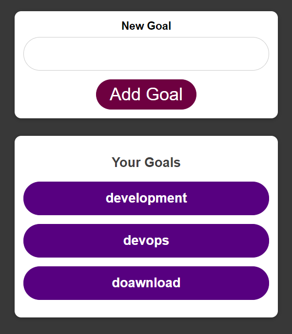

<div align="center">

  
  <h1>:pushpin::star2: Deploy Fullstack Goals App with AWS ECS</h1>
  
  <p>
    Deploy Fullstack Goals App with AWS Elastic Container Service
  </p>
  
  
<!-- Badges -->
<p>
  <a href="https://github.com/monthebrice2000/k8s-orchestration-projects/graphs/contributors">
    
  </a>
  <a href="">
    
  </a>
  <a href="https://github.com/monthebrice2000/k8s-orchestration-projects/network/members">
    
  </a>
  <a href="https://github.com/monthebrice2000/k8s-orchestration-projects/stargazers">
    
  </a>
  <a href="https://github.com/monthebrice2000/k8s-orchestration-projects/issues/">
    
  </a>
  <a href="https://github.com/monthebrice2000/k8s-orchestration-projects/blob/master/LICENSE">
    
  </a>
  <a href="https://github.com/monthebrice2000/k8s-orchestration-projects/pulls">
    
  </a>
  <a href="#">
    
  </a>
</p>
   
<h4>
    <a href="https://github.com/monthebrice2000/k8s-orchestration-projects/">View Demo</a>
  <span> · </span>
    <a href="https://github.com/monthebrice2000/k8s-orchestration-projects/">Documentation</a>
  <span> · </span>
    <a href="https://github.com/monthebrice2000/k8s-orchestration-projects/issues/">Report Bug</a>
  <span> · </span>
    <a href="https://github.com/monthebrice2000/k8s-orchestration-projects/issues/">Request Feature</a>
  </h4>
</div>

<br />
<!-- TABLE OF CONTENTS -->
<details open="open">
<summary>Table of Contents</summary>
  
- [:star2: About The Project](#star2-about-the-project-)
  - [:camera: Screenshots](#camera-screenshots)
  - [:space_invader: Tech Stack](#space_invader-tech-stack)
  - [:dart: Features](#dart-features)
- [:toolbox: Getting Started](#toolbox-getting-started-)
  - [:bangbang: Prerequisites](#bangbang-prerequisites)
  - [:gear: Installation](#gear-installation)
  - [:triangular_flag_on_post: Deployment](#triangular_flag_on_post-deployment)
  - [:test_tube: Tests APIs](#test_tube-tests)
- [:eyes: Usage](#eyes-usage-)
- [:wave: Contributing](#wave-contributing-)
- [:pencil2: Creators](#pencil2-creators-)
- [:scroll: Code Of Conduct](#scroll-code-of-conduct-)
- [:closed_lock_with_key: Security](#closed_lock_with_key-security-)
- [:warning: License](#warning-license-)
- [:handshake: Contact](#handshake-contact-)
- [:gem: Acknowledgements](#gem-acknowledgments-)

</details>

<!-- About the Project -->
## :star2: About The Project [🔝](#pushpinstar2-deploy-fullstack-goals-app-with-aws-ecs)
### :camera: Screenshots
<div align="center">
  
  <div>I built, containerized a php - expressjs full-stack goals application and deployed it in AWS Elastic Container Service.</div>
</div>

### :space_invader: Tech Stack

<details>
  <summary>Frontend Techs</summary>
  <ul>
    <li>Express JS</li>
    <li>React JS</li>
    <!-- <li></li> -->
  </ul>
</details>

<details>
  <summary>Migrations</summary>
  <ul>
    <li>Mongoose</li>
    <!-- <li><a href="https://hibernate.org/"></a></li> -->
  </ul>
</details>

<details>
  <summary>Server</summary>
  <ul>
    <li>Node JS</li>
    <!-- <li><a href="https://httpd.apache.org/"></a></li>
    <li><a href="https://spring.io/projects/spring-cloud-gateway/">Spring Gateway</a></li> -->
  </ul>
</details>

<details>
<summary>Database</summary>
  <ul>
    <!-- <li></li> -->
    <li>Mongo DB, AWS DocumentDB</li>
  </ul>
</details>

<details>
<summary>DevOps</summary>
  <ul>
    <li><a href="https://www.docker.com/"></a></li>
    <li><a href="https://kubernetes.io/"></a></li>
    <li>aws ec2+vpc, ssh, docker, aws ecr, aws iam, aws ecs, aws route 53, aws cloudwatch, aws efs, aws s3, aws RDS, aws DocumentDB,
aws application load balancer, aws CloudFormation, aws Cloud Map</li>
  </ul>
</details>

### :dart: Features
  * [x] CRUD Goals Service

## :toolbox: Getting Started [🔝](#pushpinstar2-deploy-fullstack-goals-app-with-aws-ecs)

### :bangbang: Prerequisites
This project uses AWS Elastic Container Service (ECS), AWS Elastic Container Registry (ECR), AWS CLI, Docker CLI AWS IAM to create cluster and deploy app cluster

To use docker, aws cli, and postman:
- <a href="https://docs.docker.com/engine/install/ubuntu/">Install docker and containerd</a>
- <a href="https://docs.aws.amazon.com/cli/latest/userguide/getting-started-install.html">Install AWS CLI</a>

### :gear: Installation
Follow this link [aws cli](https://docs.aws.amazon.com/cli/latest/userguide/getting-started-install.html) and [docker](https://docs.docker.com/engine/install/ubuntu/) to install aws cli and docker

To check if docker and aws is installing, run 
```bash
  aws --version
  docker version
```
I use aws-cli/2.9.17, docker CLI v20.10.17 and docker Server engine v20.10.17

To handle aws credentials , create access key and secret key for user:
- <a href="https://docs.aws.amazon.com/IAM/latest/UserGuide/id_credentials_access-keys.html#Using_CreateAccessKey">Handle IAM Access Keys and IAM Secret Keys</a>
```bash
  aws configure --profile default 
```

Create AWS IAM user and attach policies:
<details>
  <summary>Click to expand</summary>
    
    
</details>


Login to AWS ECR with aws cli:
```bash
  aws ecr get-login-password --region <region> | docker login --username AWS --password-stdin <aws_account_id>.dkr.ecr.<region>.amazonaws.com
```
<details>
  <summary>Click to expand</summary>
    
</details>

### :triangular_flag_on_post: Deployment
Clone the project
```bash
  git clone git@github.com:monthebrice2000/k8s-orchestration-projects.git
```

Go to the project directory
```bash
  cd k8s-orchestration-projects/04_mern-fullstack-goals-app
```

Create **goals-backend-repo**/**goals-frontend-repo** ECR repositories | Build, Tag and Push Image to new ecr repository:
- <a href="https://docs.aws.amazon.com/AmazonECR/latest/userguide/getting-started-cli.html#cli-create-repository">Create a repository, Push an image to Amazon ECR</a>
<details>
<summary>Click to expand</summary>
    
    
    
</details>

Create **mern-goals-app-cluster** ECS with aws cli or console:
- <a href="https://docs.aws.amazon.com/AmazonECS/latest/developerguide/get-set-up-for-amazon-ecs.html">Prerequites</a>
- <a href="https://docs.aws.amazon.com/AmazonECS/latest/developerguide/getting-started-fargate.html#get-started-fargate-cluster">Create **mern-goals-app-cluster** cluster with console</a>
<details>
<summary>Click to expand</summary>
    
</details>

Create **goals-backend-td**/**goals-frontend-td** Task Definitions in ECS with console:
- <a href="https://docs.aws.amazon.com/AmazonECS/latest/developerguide/getting-started-fargate.html#get-started-fargate-task-def">Create **goals-app-td** task definition</a>
<details>
<summary>Click to expand</summary>
    
</details>

Create **goals-backend-service**/**goals-frontend-service** service in ECS cluster with console:
- <a href="https://docs.aws.amazon.com/AmazonECS/latest/developerguide/getting-started-fargate.html#create-linux-service">Create **goals-backend-service**/**goals-frontend-service** service</a>
<details>
<summary>Click to expand</summary>
    
    
    
</details>


### :test_tube: Tests
Results of request **goals-backend-service**/**goals-frontend-service**  service in ECS cluster:

Request Frontend **Goals App**:
<details>
<summary>Click to expand</summary>
    
</details>

Request Backend **Goals API**:
<details>
<summary>Click to expand</summary>
    
</details>

Add **devops goal** / **development goal**:
<details>
<summary>Click to expand</summary>
    <br>
    <br>
</details>

Delete **download goal**:
<details>
<summary>Click to expand</summary>
    <br>
</details>

## :eyes: Usage [🔝](#pushpinstar2-spring-cloud-kubernetes-k8s)

## :wave: Contributing [🔝](#pushpinstar2-spring-cloud-kubernetes-k8s)
<a href="https://github.com/monthebrice2000/k8s-orchestration-projects/graphs/contributors">
  
</a>

Everyone is welcome to contribute to this project. Feel free to open an issue if you have question or found a bug. Totally open to any suggestions and improvements.

See `contributing.md` for ways to get started.

## :pencil2: Creators [🔝](#pushpinstar2-spring-cloud-kubernetes-k8s)
|                                                                                                                                                    Author                                                                                                                                                     |                                                                                                                                     Collaborator                                                                                                                                      |
| :-----------------------------------------------------------------------------------------------------------------------------------------------------------------------------------------------------------------------------------------------------------------------------------------------------------: | :-----------------------------------------------------------------------------------------------------------------------------------------------------------------------------------------------------------------------------------------------------------------------------------: |
| [<br><sub>@monthebrice2000</sub>](https://github.com/monthebrice2000) <br><br> [](https://github.com/sponsors/monthebrice2000) | |

## :scroll: Code Of Conduct [🔝](#pushpinstar2-spring-cloud-kubernetes-k8s)
Please read the [Code of Conduct](https://github.com/monthebrice2000/k8s-orchestration-projects/blob/master/CODE_OF_CONDUCT.md)

## :closed_lock_with_key: Security [🔝](#pushpinstar2-spring-cloud-kubernetes-k8s)
Please read the [Security Policy](https://github.com/monthebrice2000/k8s-orchestration-projects/blob/master/SECURITY.md)

## :warning: License [🔝](#pushpinstar2-spring-cloud-kubernetes-k8s)
This project is licensed under the **Unlicense**. Feel free to edit and distribute this template as you like.

See [LICENSE](../LICENSE) for more information.

## :handshake: Contact [🔝](#pushpinstar2-spring-cloud-kubernetes-k8s)
Your Name - [](https://twitter.com/BriceMonthe1) - [](mailto:monthedjeumoubrice2000@gmail.com)

Projects Link: [](https://github.com/monthebrice2000/professional-portfolio-me)

## :gem: Acknowledgments [🔝](#pushpinstar2-spring-cloud-kubernetes-k8s)
All useful resources and libraries that I have used in this projects
 - [Kubernetes docs](https://kubernetes.io/docs/home/)
 - [StackOver flow kubernetes solution](https://stackoverflow.com/questions/tagged/kubernetes)

