<div align="center">

  
  <h1>:pushpin::star2: Deploy a PERN Caching Index App to Azure Container App Service with Travis CI </h1>
  
  <p>
   Deploy a fullstack app to Azure Container App Service with Travis CI
  </p>  
  
  
<!-- Badges -->
<p>
  <a href="https://github.com/monthebrice2000/k8s-orchestration-projects/graphs/contributors">
    
  </a>
  <a href="">
    
  </a>
  <a href="https://github.com/monthebrice2000/k8s-orchestration-projects/network/members">
    
  </a>
  <a href="https://github.com/monthebrice2000/k8s-orchestration-projects/stargazers">
    
  </a>
  <a href="https://github.com/monthebrice2000/k8s-orchestration-projects/issues/">
    
  </a>
  <a href="https://github.com/monthebrice2000/k8s-orchestration-projects/blob/master/LICENSE">
    
  </a>
  <a href="https://github.com/monthebrice2000/k8s-orchestration-projects/pulls">
    
  </a>
  <a href="#">
    
  </a>
</p>
   
<h4>
    <a href="https://github.com/monthebrice2000/k8s-orchestration-projects/">View Demo</a>
  <span> · </span>
    <a href="https://github.com/monthebrice2000/k8s-orchestration-projects/">Documentation</a>
  <span> · </span>
    <a href="https://github.com/monthebrice2000/k8s-orchestration-projects/issues/">Report Bug</a>
  <span> · </span>
    <a href="https://github.com/monthebrice2000/k8s-orchestration-projects/issues/">Request Feature</a>
  </h4>
</div>

<br />
<!-- TABLE OF CONTENTS -->
<details open="open">
<summary>Table of Contents</summary>
  
- [:star2: About The Project](#star2-about-the-project-)
  - [:camera: Screenshots](#camera-screenshots)
  - [:space_invader: Tech Stack](#space_invader-tech-stack)
  - [:dart: Features](#dart-features)
- [:toolbox: Getting Started](#toolbox-getting-started-)
  - [:bangbang: Prerequisites](#bangbang-prerequisites)
  - [:gear: Installation](#gear-installation)
  - [:triangular_flag_on_post: Deployment](#triangular_flag_on_post-deployment)
  - [:test_tube: Tests APIs](#test_tube-tests)
- [:eyes: Usage](#eyes-usage-)
- [:wave: Contributing](#wave-contributing-)
- [:pencil2: Creators](#pencil2-creators-)
- [:scroll: Code Of Conduct](#scroll-code-of-conduct-)
- [:closed_lock_with_key: Security](#closed_lock_with_key-security-)
- [:warning: License](#warning-license-)
- [:handshake: Contact](#handshake-contact-)
- [:gem: Acknowledgements](#gem-acknowledgments-)

</details>

<!-- About the Project -->
## :star2: About The Project [🔝](#pushpinstar2-spring-cloud-kubernetes-k8s)
### :camera: Screenshots
<div align="center"> 
  
  <div>I contaierized a fullstack Postgres-Express-React-Node caching index app with Docker and automated deployment to Azure Container App Service with Travis CI.</div>
</div>

### :space_invader: Tech Stack

<details>
  <summary>API REST</summary>
  <ul>
    <li>Express JS</li>
  </ul>
</details>

<details>
  <summary>Migrations</summary>
  <ul>
    <li>pg</a></li>
  </ul>
</details>

<details>
  <summary>Server</summary>
  <ul>
    <li>Node js</li>
  </ul>
</details>

<details>
<summary>Database</summary>
  <ul>
    <li>Azure Postgres DB</li>
  </ul>
</details>

<details>
<summary>DevOps</summary>
  <ul>
    <li>Nginx</li>
    <li>Git / Github</li>
    <li>Travis CI</li>
    <li>Azure Redis Cache</li>
    <li>Azure Container App Service</li>
    <li>Azure Container Registry</li>
  </ul>
</details>

### :dart: Features
  * [x] CRUD Caching Index Service

## :toolbox: Getting Started [🔝](#pushpinstar2-spring-cloud-kubernetes-k8s)

### :bangbang: Prerequisites
This project uses Azure App Service container, Azure container registry, Travis CI, Azure CLI.

To use docker, azure cli, travis cli:
- <a href="https://docs.docker.com/engine/install/ubuntu/">Install docker and containerd</a>
- <a href="https://learn.microsoft.com/en-us/cli/azure/install-azure-cli">Install Azure CLI</a>
- <a href="https://github.com/travis-ci/travis.rb#installation">Install Travis CLI</a>

### :gear: Installation
Follow this link [Travis CI CLI](https://github.com/travis-ci/travis.rb#installation), [azure CLI](https://learn.microsoft.com/en-us/cli/azure/install-azure-cli) and [docker](https://docs.docker.com/engine/install/ubuntu/) to install travis ci CLI, Azure CLI and docker

To check if kubectl and gcloud is installing, run 
```bash
  az version
  travis version
  docker version
```
I use azure-cli v2.44.1, travis v1.11.0, and docker CLI v20.10.17 and docker Server engine v20.10.17

<!-- Login to Azure cloud with cli:
- <a href="https://azure.microsoft.com/en-us/get-started/azure-portal">Connect to Azure Dashboard</a>
```bash
  az login
```
<details>
  <summary>Click to expand</summary>
    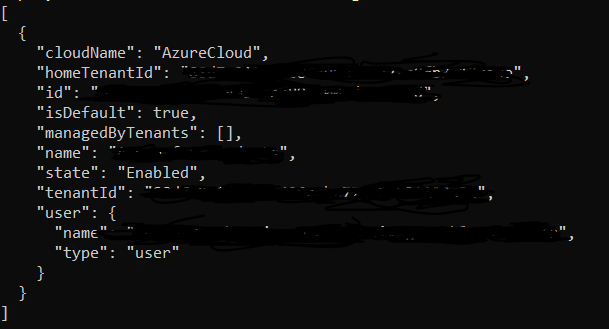
</details>
-->

Create **cachingindexregistry** Azure Container Registry:
- <a href="https://learn.microsoft.com/en-us/azure/container-registry/container-registry-get-started-azure-cli">Create **cachingindexregistry** Azure Container Registry</a>
  ```bash
  az acr create --resource-group myResourceGroup \
    --name cachingindexregistry --sku Basic
  ```
<details>
<summary>Click to expand</summary>
    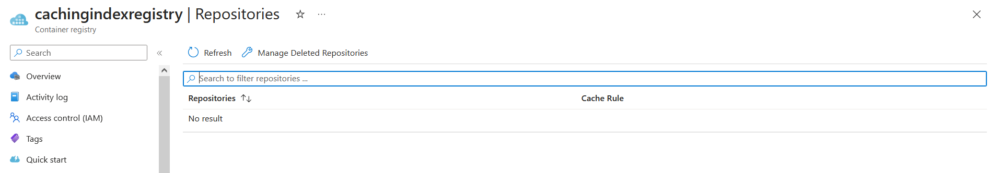
</details>

Create **cachingindex-app-service** Azure Container App Service:
- <a href="https://learn.microsoft.com/en-us/azure/container-apps/quickstart-portal">Create **cachingindex-app-service** Azure Container App Service</a>
  ```bash
  az containerapp up \
  --name cachingindex-app-service \
  --resource-group <my-container-apps> \
  --location eastus \
  --environment 'react-app-service' \
  --image reactRegistry2/react-app:latest \
  --target-port 80 \
  --ingress external \
  --query properties.configuration.ingress.fqdn
  ```
<details>
<summary>Click to expand</summary>
    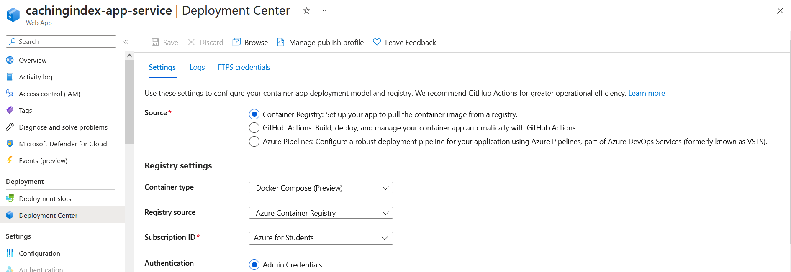
</details>

<!-- Add app service webhook to azure container registry
<details>
<summary>Click to expand</summary>
    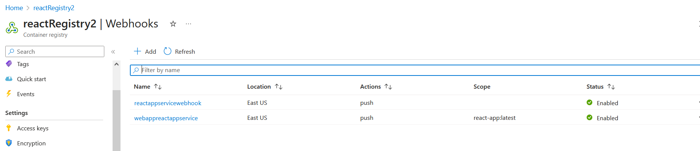
</details>
-->

Login Travis CI with Github Apps:
- <a href="https://app.travis-ci.com/signin">Login Travis CI with Github Apps</a>
<details>
<summary>Click to expand</summary>
  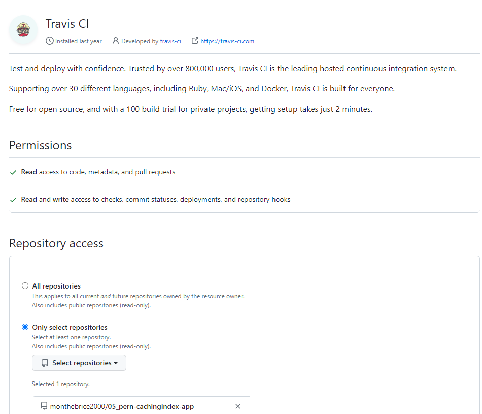<br>
  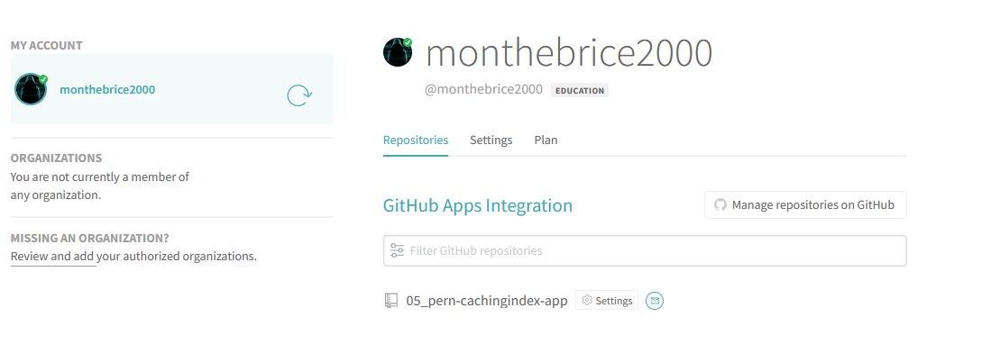
</details>

Create **cachingindex-dbserver** Azure Postgresql flexible server:
<details>
<summary>Click to expand</summary>
  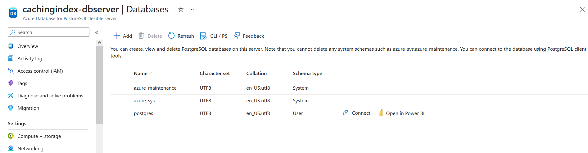<br>
</details>

Create **cachingindex-cache** Azure Redis Cache:
<details>
<summary>Click to expand</summary>
  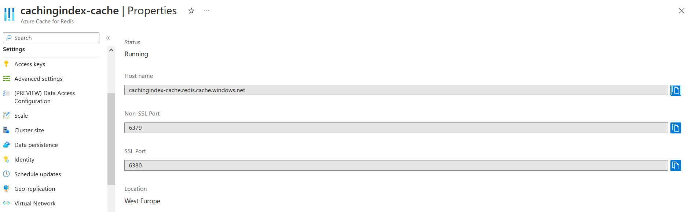<br>
</details>

Add Environment variables in Travis CI repository:
- <a href="https://docs.travis-ci.com/user/environment-variables/">Add Environment variables in Travis CI repository</a>
<details>
<summary>Click to expand</summary>
  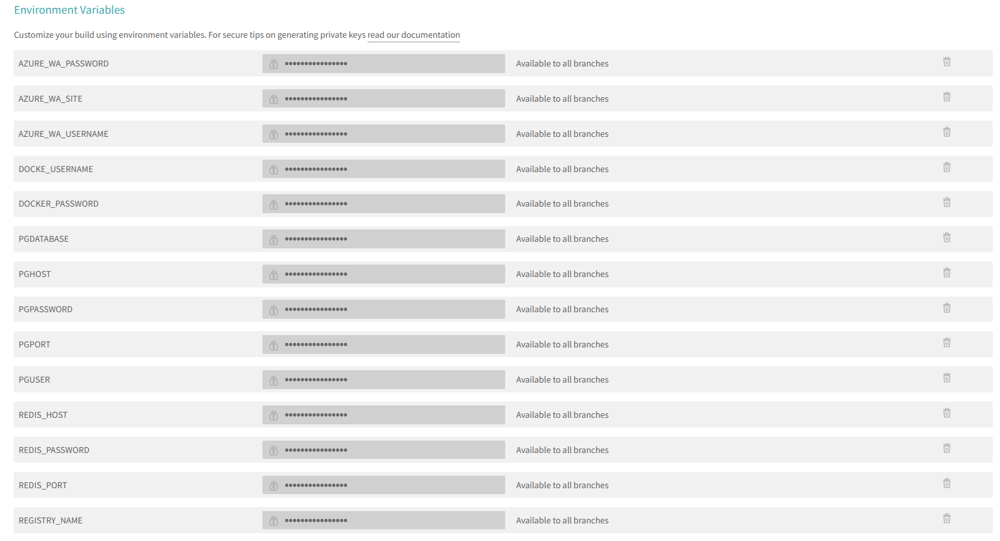
</details>

Add Environment variables in azure container service application:
<details>
<summary>Click to expand</summary>
  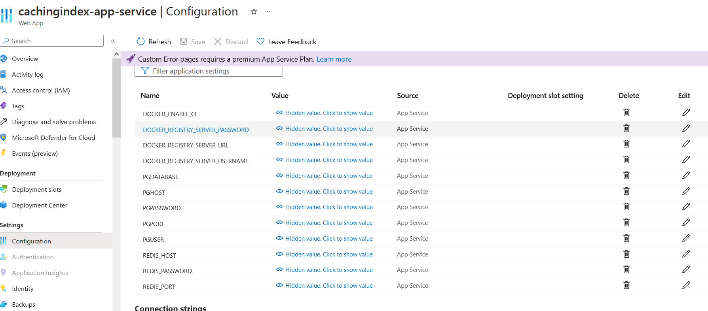
</details>

Create **fibvalues** database:
<details>
<summary>Click to expand</summary>
  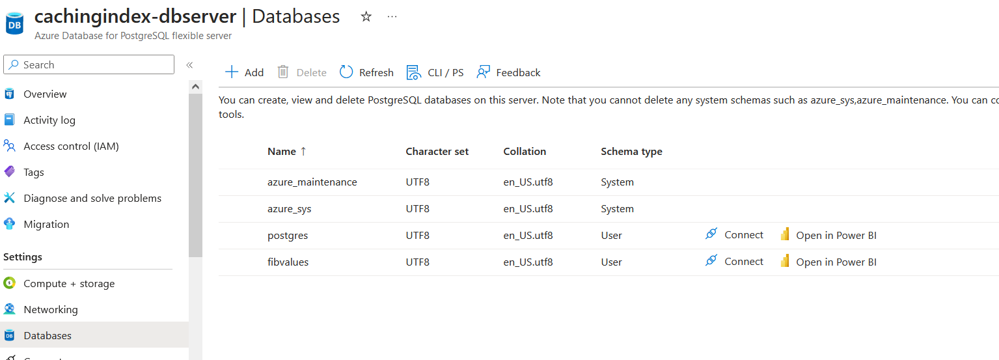<br>
  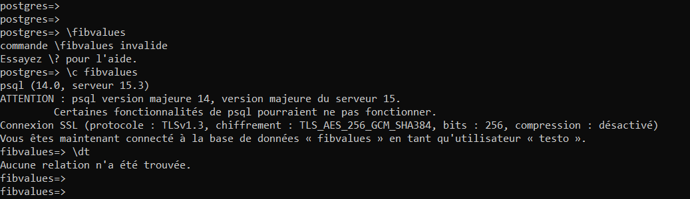<br>
</details>

### :triangular_flag_on_post: Deployment
Clone the project
```bash
  git clone git@github.com:monthebrice2000/05_pern-cachingindex-app.git
```
Create .deocker.env file like sample.docker.env and fill paramameters:
```bash
REDIS_HOST=
REDIS_PORT=
REDIS_PASSWORD=
PGUSER=postgres
PGHOST=
PGDATABASE=
PGPASSWORD=
PGPORT=
```

Look .travis.yml file:
```bash
sudo: required
language: generic

services:
  - docker

before_install:
  - docker build -t cachingindexregistry.azurecr.io/cachingindex-app-dev -f ./client/Dockerfile.dev ./client

script:
  - docker run -e CI=true cachingindexregistry.azurecr.io/cachingindex-app-dev npm test -- --coverage

after_success:
  - docker build -t cachingindexregistry.azurecr.io/cachingindex-app ./client
  - docker build -t cachingindexregistry.azurecr.io/nginx-proxy ./nginx
  - docker build -t cachingindexregistry.azurecr.io/cachingindex-api ./server
  - docker build -t cachingindexregistry.azurecr.io/worker-api ./worker

  - echo "$DOCKER_PASSWORD" | docker login -u "$DOCKER_USERNAME" --password-stdin $REGISTRY_NAME

  - docker push cachingindexregistry.azurecr.io/cachingindex-app
  - docker push cachingindexregistry.azurecr.io/nginx-proxy
  - docker push cachingindexregistry.azurecr.io/cachingindex-api
  - docker push cachingindexregistry.azurecr.io/worker-api

deploy:
  provider: azure_web_apps
  username: $AZURE_WA_USERNAME
  password:
    secure: $AZURE_WA_PASSWORD
  site: $AZURE_WA_SITE
  on:
    branch: master
```

Link 05_pern-cachingindex-app github repository to travis yml:
<details>
<summary>Click to expand</summary>
    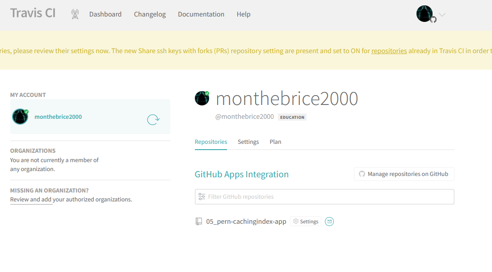
</details>

Create branch **feature** :
```bash
  git checkout feature
```
Push one commit to feature branch :
```bash
  git add . && git commit -m "first commit" && git push origin feature
```

Create pull request and merge to master after integration finish in travis yml:
<details>
<summary>Click to expand</summary>
    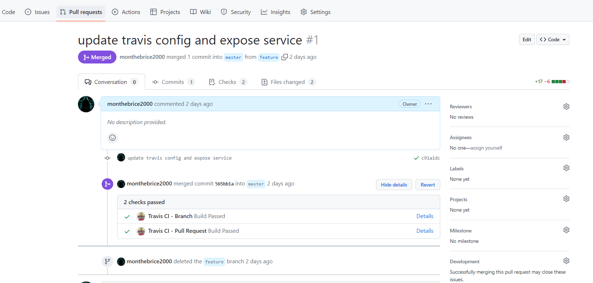
</details>

After Merge, look to travis build workflow:
<details>
<summary>Click to expand</summary>
  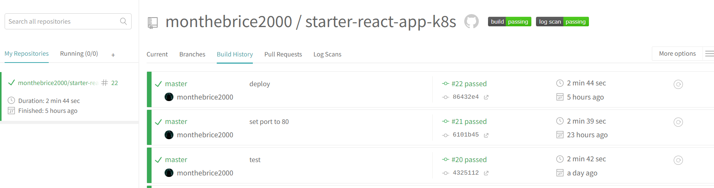<br>
  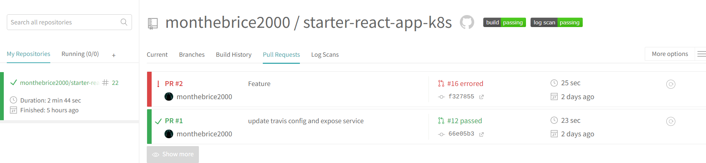
</details>

Look logs deploy success:
<details>
<summary>Click to expand</summary>
    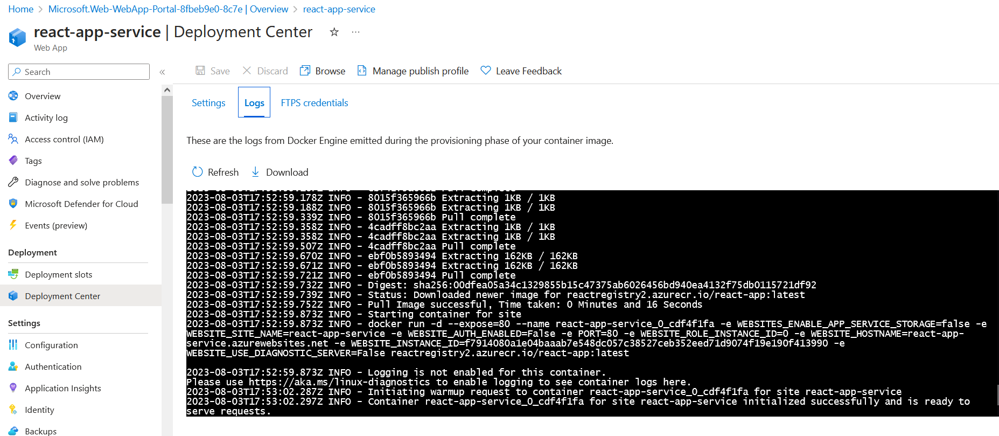
</details>

Look deployment:
<details>
<summary>Click to expand</summary>
    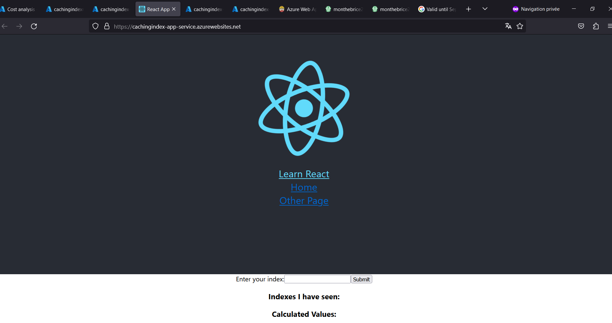
</details>

Look travis workflows:
<details>
<summary>Click to expand</summary>
    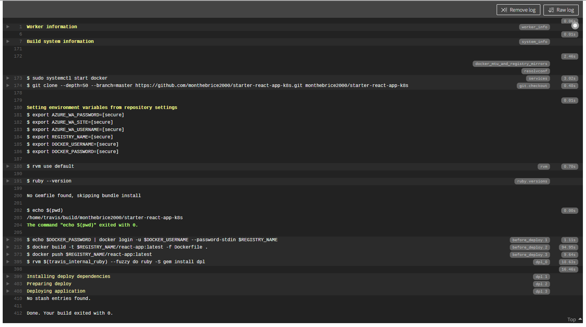
</details>


### :test_tube: Tests
Look all images in Azure container registry:
<details>
<summary>Click to expand</summary>
    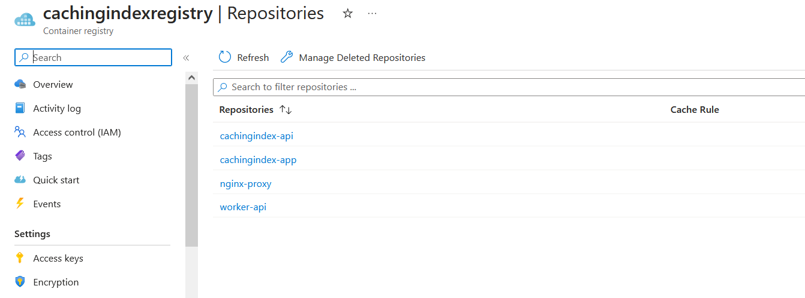
</details>

Navigate to App [https://react-app-service.azurewebsites.net/]([url](https://react-app-service.azurewebsites.net/)):
<details>
<summary>Click to expand</summary>
    
</details>

After insert 19, 3, 40:
<details>
<summary>Click to expand</summary>
    
</details>

Look **fibvalues** database:
<details>
<summary>Click to expand</summary>
    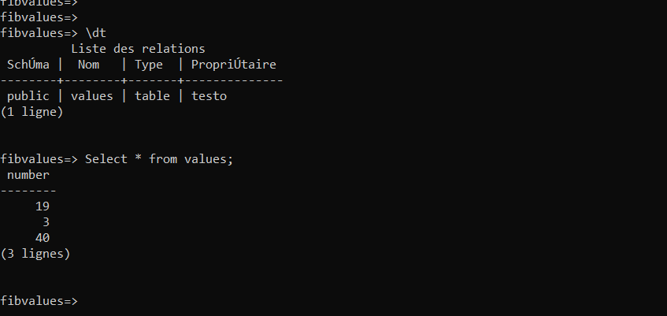
</details>

Look cache:
<details>
<summary>Click to expand</summary>
    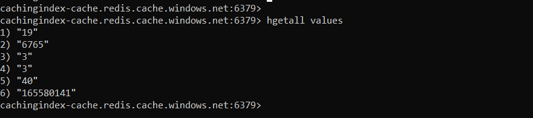
</details>

## :eyes: Usage [🔝](#pushpinstar2-spring-cloud-kubernetes-k8s)


## :wave: Contributing [🔝](#pushpinstar2-kubernetes-(K8s)-orchestration-projects)
<a href="https://github.com/monthebrice2000/professional-portfolio-me/graphs/contributors">
  
</a>

Everyone is welcome to contribute to this project. Feel free to open an issue if you have question or found a bug. Totally open to any suggestions and improvements.

See `contributing.md` for ways to get started.

## :pencil2: Creators [🔝](#pushpinstar2-kubernetes-(K8s)-orchestration-projects)
|                                                                                                                                                    Author                                                                                                                                                     |                                                                                                                                     Collaborator                                                                                                                                      |
| :-----------------------------------------------------------------------------------------------------------------------------------------------------------------------------------------------------------------------------------------------------------------------------------------------------------: | :-----------------------------------------------------------------------------------------------------------------------------------------------------------------------------------------------------------------------------------------------------------------------------------: |
| [<br><sub>@monthebrice2000</sub>](https://github.com/monthebrice2000) <br><br> [](https://github.com/sponsors/monthebrice2000) | |

## :scroll: Code Of Conduct [🔝](#pushpinstar2-kubernetes-(K8s)-orchestration-projects)
Please read the [Code of Conduct](https://github.com/monthebrice2000/k8s-orchestration-projects/blob/master/CODE_OF_CONDUCT.md)

## :closed_lock_with_key: Security [🔝](#pushpinstar2-kubernetes-(K8s)-orchestration-projects)
Please read the [Security Policy](https://github.com/monthebrice2000/k8s-orchestration-projects/blob/master/SECURITY.md)

## :warning: License [🔝](#pushpinstar2-kubernetes-(K8s)-orchestration-projects)
This project is licensed under the **Unlicense**. Feel free to edit and distribute this template as you like.

See [LICENSE](LICENSE) for more information.

## :handshake: Contact [🔝](#pushpinstar2-kubernetes-(K8s)-orchestration-projects)
Your Name - [](https://twitter.com/BriceMonthe1) - [](mailto:monthedjeumoubrice2000@gmail.com)

Projects Link: [](https://github.com/monthebrice2000/professional-portfolio-me)

## :gem: Acknowledgments [🔝](#pushpinstar2-kubernetes-(K8s)-orchestration-projects)
All useful resources and libraries that I have used in this projects
 - [Kubernetes docs](https://kubernetes.io/docs/home/)
 - [StackOver flow kubernetes solution](https://stackoverflow.com/questions/tagged/kubernetes)
 - [AWS Elastic Container Service](https://docs.aws.amazon.com/fr_fr/AmazonECS/latest/developerguide/Welcome.html)

