<div align="center">

  
  <h1>:pushpin::star2: Deploy a Caching Index App with Kubernete</h1>
  
  <p>
    Deploy a PERN Caching Index App to Google Kubernetes Service with Circle CI
  </p>
  
  
<!-- Badges -->
<p>
  <a href="https://github.com/monthebrice2000/k8s-orchestration-projects/graphs/contributors">
    
  </a>
  <a href="">
    
  </a>
  <a href="https://github.com/monthebrice2000/k8s-orchestration-projects/network/members">
    
  </a>
  <a href="https://github.com/monthebrice2000/k8s-orchestration-projects/stargazers">
    
  </a>
  <a href="https://github.com/monthebrice2000/k8s-orchestration-projects/issues/">
    
  </a>
  <a href="https://github.com/monthebrice2000/k8s-orchestration-projects/blob/master/LICENSE">
    
  </a>
  <a href="https://github.com/monthebrice2000/k8s-orchestration-projects/pulls">
    
  </a>
  <a href="#">
    
  </a>
</p>
   
<h4>
    <a href="https://github.com/monthebrice2000/k8s-orchestration-projects/">View Demo</a>
  <span> · </span>
    <a href="https://github.com/monthebrice2000/k8s-orchestration-projects/">Documentation</a>
  <span> · </span>
    <a href="https://github.com/monthebrice2000/k8s-orchestration-projects/issues/">Report Bug</a>
  <span> · </span>
    <a href="https://github.com/monthebrice2000/k8s-orchestration-projects/issues/">Request Feature</a>
  </h4>
</div>

<br />
<!-- TABLE OF CONTENTS -->
<details open="open">
<summary>Table of Contents</summary>
  
- [:star2: About The Project](#star2-about-the-project-)
  - [:camera: Screenshots](#camera-screenshots)
  - [:space_invader: Tech Stack](#space_invader-tech-stack)
  - [:dart: Features](#dart-features)
- [:toolbox: Getting Started](#toolbox-getting-started-)
  - [:bangbang: Prerequisites](#bangbang-prerequisites)
  - [:gear: Installation](#gear-installation)
  - [:triangular_flag_on_post: Deployment](#triangular_flag_on_post-deployment)
  - [:test_tube: Tests APIs](#test_tube-tests)
- [:eyes: Usage](#eyes-usage-)
- [:wave: Contributing](#wave-contributing-)
- [:pencil2: Creators](#pencil2-creators-)
- [:scroll: Code Of Conduct](#scroll-code-of-conduct-)
- [:closed_lock_with_key: Security](#closed_lock_with_key-security-)
- [:warning: License](#warning-license-)
- [:handshake: Contact](#handshake-contact-)
- [:gem: Acknowledgements](#gem-acknowledgments-)

</details>

<!-- About the Project -->
## :star2: About The Project [🔝](#pushpinstar2-spring-cloud-kubernetes-k8s)
### :camera: Screenshots
<div align="center"> 
  
  <div>I built, containerized a full-stack caching index application and deployed it in Google Kubernetes Engine with Circle CI pipeline.</div>
</div>

### :space_invader: Tech Stack

<details>
  <summary>API REST</summary>
  <ul>
    <li>Express JS</li>
  </ul>
</details>

<details>
  <summary>Migrations</summary>
  <ul>
    <li>pg</a></li>
  </ul>
</details>

<details>
  <summary>Server</summary>
  <ul>
    <li>Node js</li>
  </ul>
</details>

<details>
<summary>Database</summary>
  <ul>
    <li>Postgres DB</li>
  </ul>
</details>

<details>
<summary>DevOps</summary>
  <ul>
    <li>Nginx</li>
    <li>Git / Github</li>
    <li>Travis CI</li>
    <li>Redis Cache</li>
    <li>Google Kubernetes Engines</li>
    <li>Google Container registry</li>
    <li>Circle CI pipeline</li>
  </ul>
</details>

### :dart: Features
  * [x] CRUD Caching Index Service

## :toolbox: Getting Started [🔝](#pushpinstar2-spring-cloud-kubernetes-k8s)

### :bangbang: Prerequisites
This project uses Google Kubernetes Engine (GKE), kubectl, gcloud to create cluster and deploy app cluster
This project also uses Postman API to test users APIs and tasks APIs

To use docker, gcloud cli, kubectl cli, aws cli, postman, and helm:
- <a href="https://docs.docker.com/engine/install/ubuntu/">Install docker and containerd</a>
- <a href="https://kubernetes.io/docs/tasks/tools/">Install Kubectl</a>
- <a href="https://cloud.google.com/sdk/docs/install?hl=fr">Install gcloud</a>
- <a href="https://www.postman.com/downloads/">Install Postman API</a>
- <a href="https://helm.sh/docs/intro/install/">Install Helm</a>

### :gear: Installation
Follow this link [kubectl](https://kubernetes.io/docs/tasks/tools/), [gcloud](https://cloud.google.com/sdk/docs/install?hl=fr), [docker](https://docs.docker.com/engine/install/ubuntu/) and [helm](https://helm.sh/docs/intro/install/) to install kubectl, gcloud, docker and helm

To check if kubectl and gcloud is installing, run 
```bash
  kubectl version
  gcloud version
  docker version
  helm version
```
I use kubectl v1.25.0, gcloud (Google Cloud SDK 406.0.0, beta 2022.10.17, bq 2.0.79, core 2022.10.17, gcloud-crc32c 1.0.0, gke-gcloud-auth-plugin 0.4.0, gsutil 5.14) , and docker CLI v20.10.17 and docker Server engine v20.10.17, helm v3.13.0

Create Project, Create Service Account, Create token key, :
<details>
<summary>Click to expand</summary>
  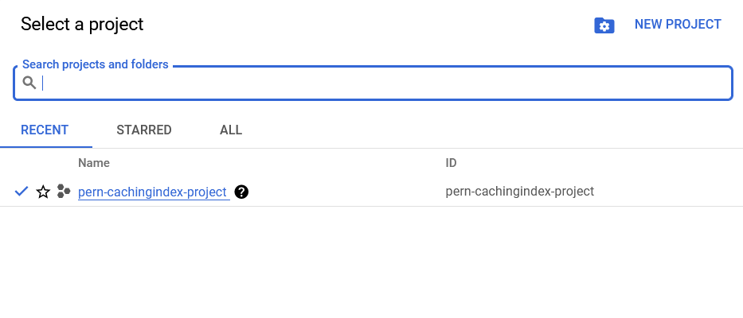<br>
  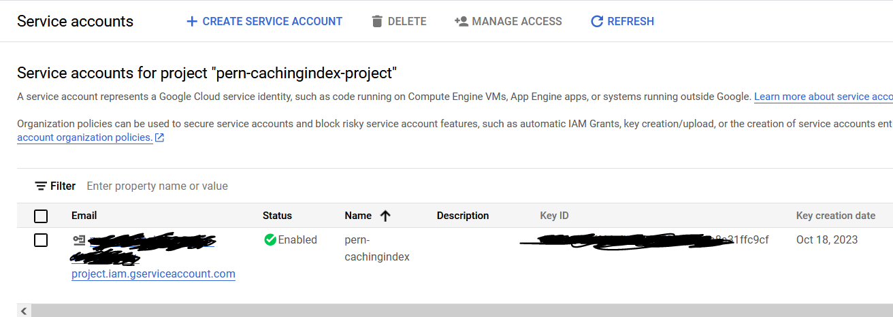<br>
  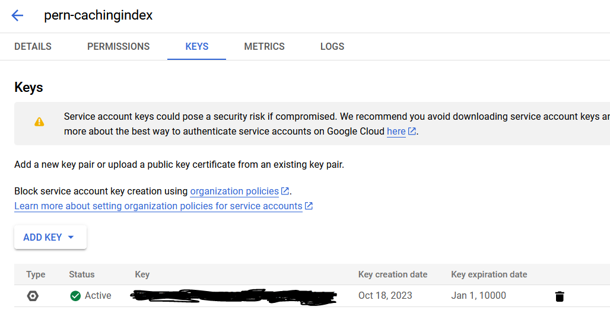<br>
</details>

Login to project, install gke-gcloud-auth-plugin plugin:
- <a href="https://cloud.google.com/blog/products/containers-kubernetes/kubectl-auth-changes-in-gke?hl=en">Install gke-gcloud-auth-plugin plugin</a>
```bash
  gcloud auth activate-service-account --key-file=service-account.json
  gcloud --quiet config set project ${GOOGLE_PROJECT_ID}
  gcloud --quiet config set compute/zone ${GOOGLE_COMPUTE_ZONE}
  gcloud components install gke-gcloud-auth-plugin
```

Activate GKE API, Create GKE cluster, Connect to cluster:
- <a href="https://console.cloud.google.com/apis/library/container.googleapis.com">Activate Kubernetes Engine API </a>
```bash
  gcloud container clusters get-credentials ${CLUSTER_NAME} --zone ${GOOGLE_COMPUTE_ZONE} --project ${GOOGLE_PROJECT_ID}
```
<details>
<summary>Click to expand</summary>
  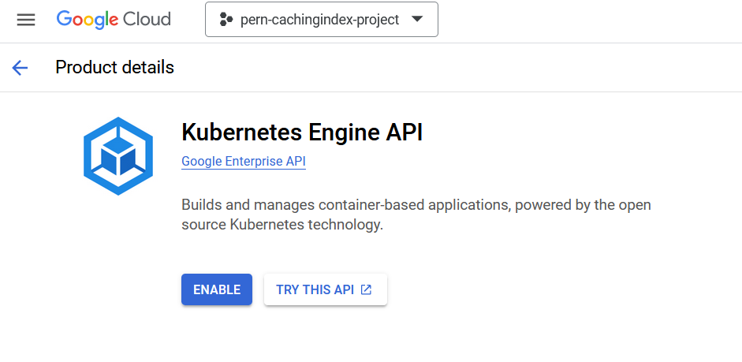<br>
  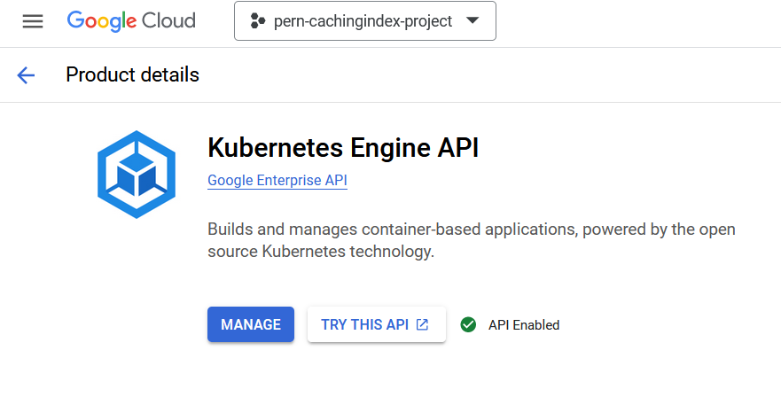<br>
</details>

Activate Google container registry api, :
<details>
<summary>Click to expand</summary>
  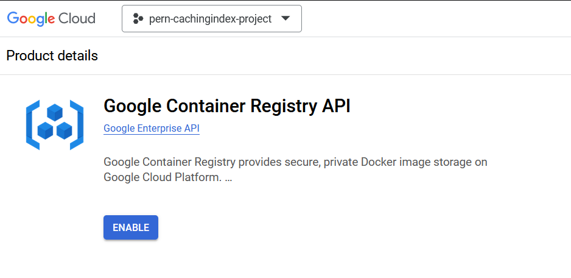<br>
  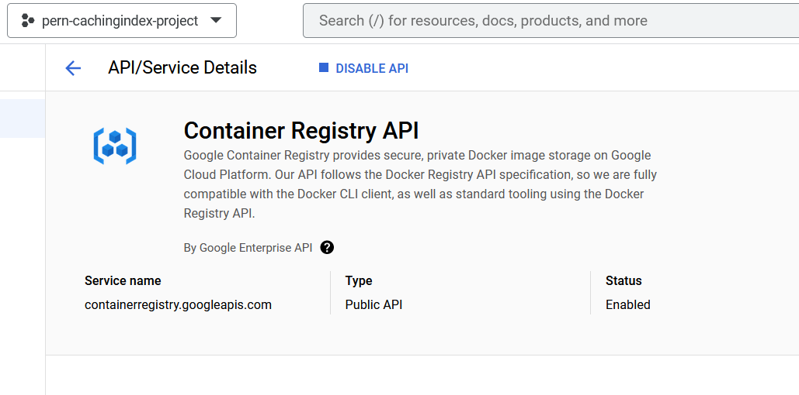<br>
</details>

Activate Cloud Resource Manager API :
<details>
<summary>Click to expand</summary>
  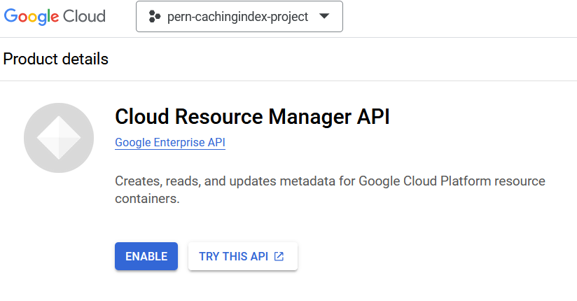<br>
  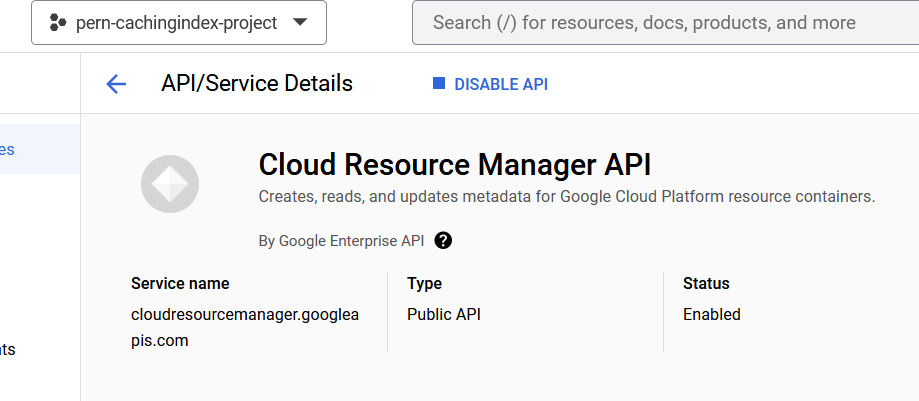<br>
</details>

Create service accounts, Install ingress-nginx controller in cluster:
```bash
  kubectk create serviceaccount --namespace kube-system sample-sa
  kubectl create clusterrolebinding sample-crb --clusterrole=cluster-admin --serviceaccount=kube-system:sample-sa

  helm repo add ingress-nginx https://kubernetes.github.io/ingress-nginx
  helm install my-ingress-nginx ingress-nginx/ingress-nginx --version 4.8.2 -n kube-system

  helm repo add cert-manager https://charts.jetstack.io
  helm install my-cert-manager cert-manager/cert-manager --version 1.13.1 --set installCRDs=true -n kube-system
```
<details>
<summary>Click to expand</summary>
    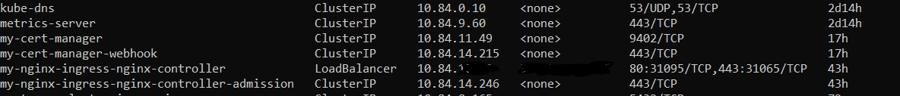
</details>

Get clusters in GKE, Get nodes in GKE:
```bash
  gcloud container clusters list
  kubectl -n kube-system get nodes -o wide
```
<details>
<summary>Click to expand</summary>
  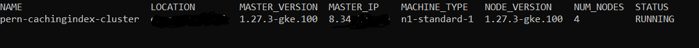<br>
  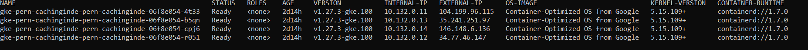<br>
</details>

Create git repository and create personal access token:
<details>
<summary>Click to expand</summary>
  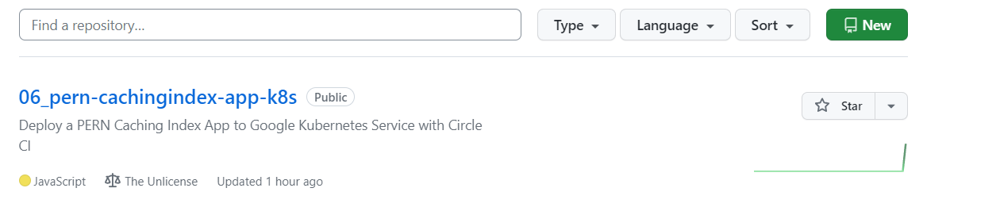<br>
  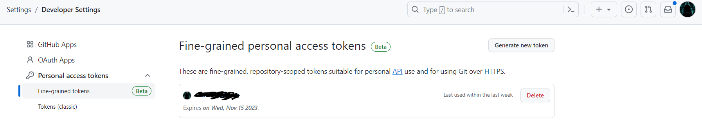<br>
</details>

Login to circle ci, Create Organisation, Create Project to link to git repository:
<details>
<summary>Click to expand</summary>
  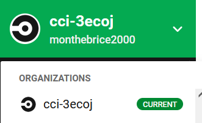<br>
  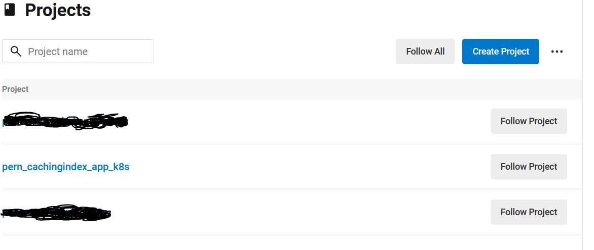<br>
  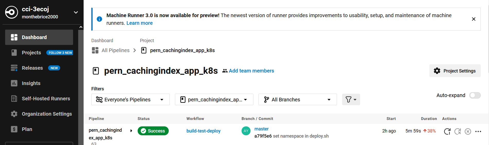<br>
</details>

Add env variables in circle ci project:
<details>
<summary>Click to expand</summary>
  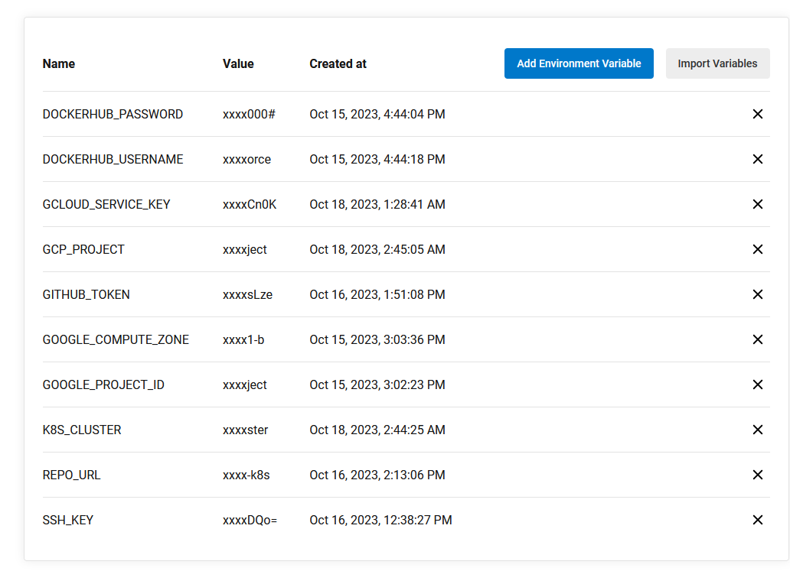<br>
</details>

### :triangular_flag_on_post: Deployment
Clone the project
```bash
  git clone git@github.com:monthebrice2000/k8s-orchestration-projects.git
```

Go to the project directory
```bash
  cd k8s-orchestration-projects/06_pern-cachingindex-app-k8s
```

Commit and push a change to github:
```bash
  git status
  git add .
  git commit -m "add change"
  git push origin master
```

Look all in one:
```bash
  kubectl -n kube-system get all
```

### :test_tube: Tests
Check Circle CI pipeline:
<details>
<summary>Click to expand</summary>
  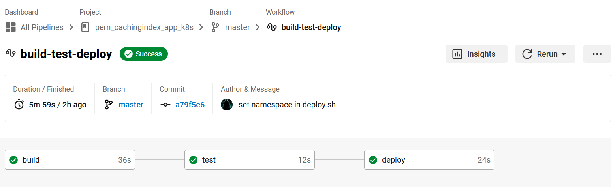<br>
  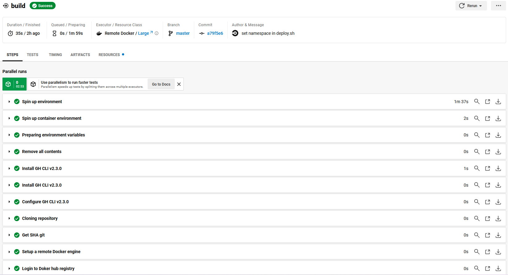<br>
  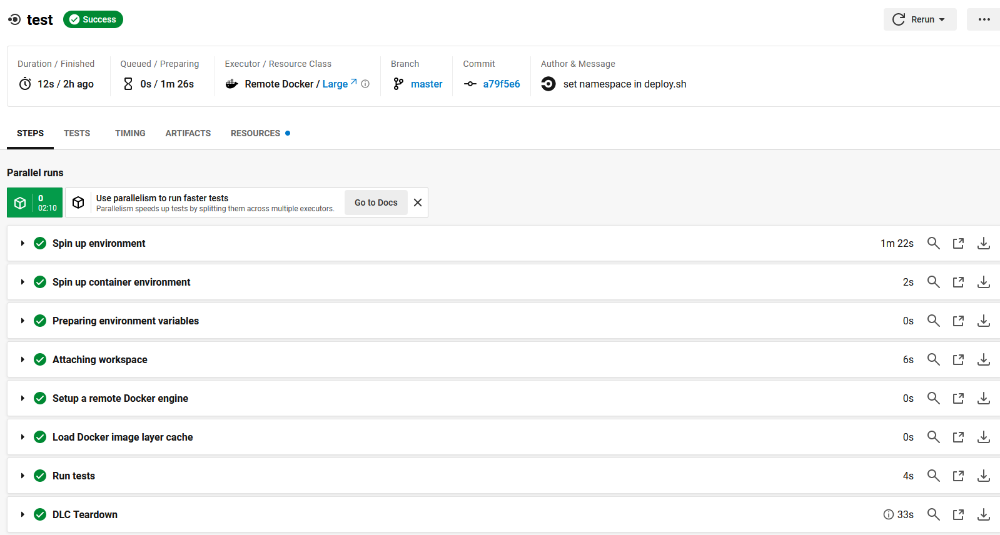<br>
  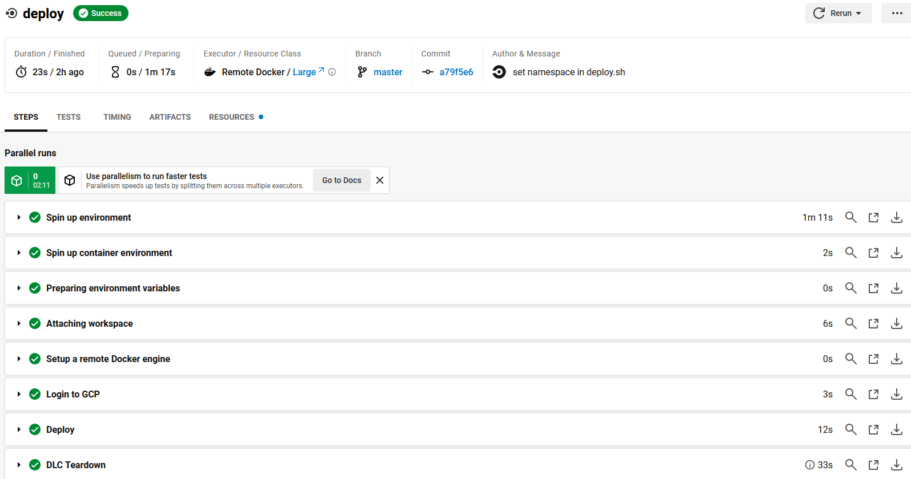<br>
</details>

Get all deployments:
<details>
<summary>Click to expand</summary>
  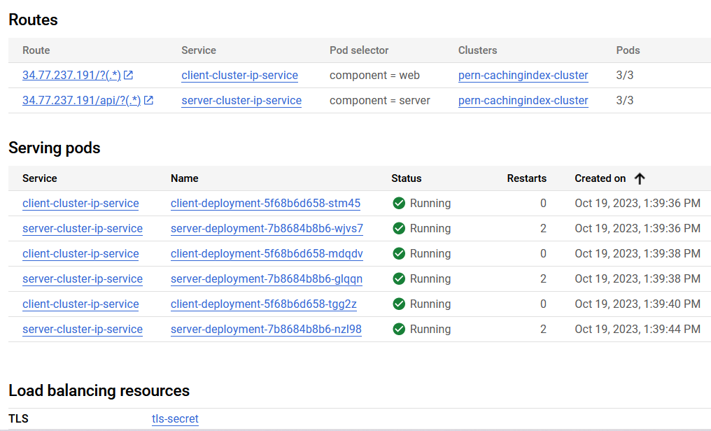<br>
  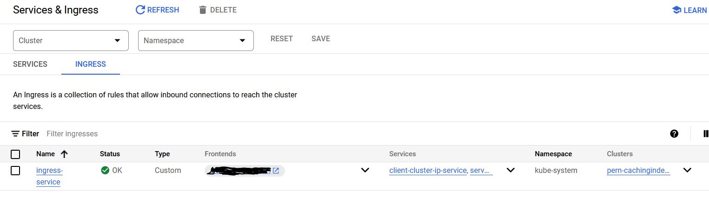<br>
</details>

Test interface:
<details>
<summary>Click to expand</summary>
  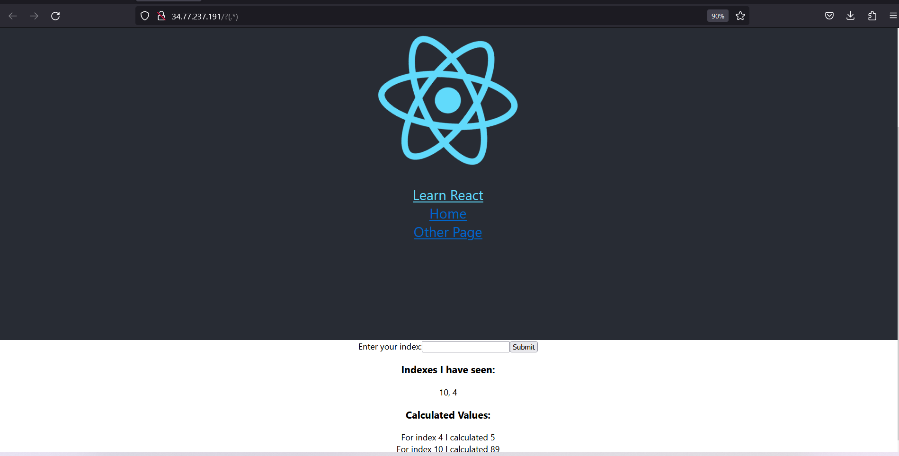<br>
</details>

## :eyes: Usage [🔝](#pushpinstar2-spring-cloud-kubernetes-k8s)


## :wave: Contributing [🔝](#pushpinstar2-kubernetes-(K8s)-orchestration-projects)
<a href="https://github.com/monthebrice2000/professional-portfolio-me/graphs/contributors">
  
</a>

Everyone is welcome to contribute to this project. Feel free to open an issue if you have question or found a bug. Totally open to any suggestions and improvements.

See `contributing.md` for ways to get started.

## :pencil2: Creators [🔝](#pushpinstar2-kubernetes-(K8s)-orchestration-projects)
|                                                                                                                                                    Author                                                                                                                                                     |                                                                                                                                     Collaborator                                                                                                                                      |
| :-----------------------------------------------------------------------------------------------------------------------------------------------------------------------------------------------------------------------------------------------------------------------------------------------------------: | :-----------------------------------------------------------------------------------------------------------------------------------------------------------------------------------------------------------------------------------------------------------------------------------: |
| [<br><sub>@monthebrice2000</sub>](https://github.com/monthebrice2000) <br><br> [](https://github.com/sponsors/monthebrice2000) | |

## :scroll: Code Of Conduct [🔝](#pushpinstar2-kubernetes-(K8s)-orchestration-projects)
Please read the [Code of Conduct](https://github.com/monthebrice2000/k8s-orchestration-projects/blob/master/CODE_OF_CONDUCT.md)

## :closed_lock_with_key: Security [🔝](#pushpinstar2-kubernetes-(K8s)-orchestration-projects)
Please read the [Security Policy](https://github.com/monthebrice2000/k8s-orchestration-projects/blob/master/SECURITY.md)

## :warning: License [🔝](#pushpinstar2-kubernetes-(K8s)-orchestration-projects)
This project is licensed under the **Unlicense**. Feel free to edit and distribute this template as you like.

See [LICENSE](LICENSE) for more information.

## :handshake: Contact [🔝](#pushpinstar2-kubernetes-(K8s)-orchestration-projects)
Your Name - [](https://twitter.com/BriceMonthe1) - [](mailto:monthedjeumoubrice2000@gmail.com)

Projects Link: [](https://github.com/monthebrice2000/professional-portfolio-me)

## :gem: Acknowledgments [🔝](#pushpinstar2-kubernetes-(K8s)-orchestration-projects)
All useful resources and libraries that I have used in this projects
 - [Kubernetes docs](https://kubernetes.io/docs/home/)
 - [StackOver flow kubernetes solution](https://stackoverflow.com/questions/tagged/kubernetes)
 - [AWS Elastic Container Service](https://docs.aws.amazon.com/fr_fr/AmazonECS/latest/developerguide/Welcome.html)